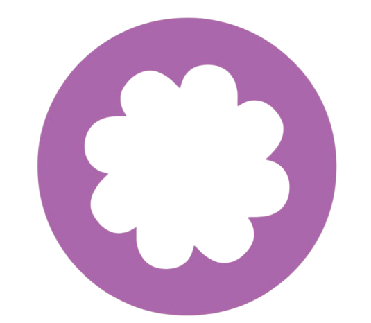

# 🌸 Mura — AI-Powered Language Learning Platform 



Welcome to **Mura**, an all-in-one, immersive, and gamified language learning platform designed to make mastering a new language fun, social, and effective. Whether you're a beginner or brushing up your fluency, Mura has you covered with interactive tools, intelligent feedback, and a vibrant community of learners.

🏆 This project was created as part of **my first ever hackathon**, where my team earned **2nd place**! I proudly led the team, contributed most of the backend and frontend development, and integrated core features like AI tutoring, video calling, and gamified challenges.

---

## ✨ Key Features

### 🧠 Gemini AI Chatbot — Your Smart Language Tutor
Chat with an intelligent AI-powered assistant (via **Gemini API**) that helps you practice vocabulary, grammar, and pronunciation in real-time conversations. It's like having a personal tutor 24/7.

### 🎥 Live Video Chat — Real Conversations with Real People
Powered by the **Agora SDK**, users can engage in live video calls with language partners, enabling real-world conversation practice from anywhere in the world.

### 🌍 Translation System — Fast & Accurate
A built-in translation feature (similar to Google Translate) allows quick and seamless text translation between multiple languages—perfect for real-time reference and learning.

### 📚 Lessons & Interactive Quizzes
Follow structured lessons tailored to different language levels. Each lesson includes quizzes to test comprehension and reinforce learning through active recall.

### ⚔️ Gamified Learning — Boss Fight Challenge
Put your skills to the test in a thrilling game where you defeat bosses by choosing the correct translations of words. Gain experience points (XP), power-ups, and level up as you progress.

### 🔥 Streaks & Level Progression
Maintain a daily learning streak to earn XP and unlock new levels. Our streak system encourages consistency and keeps learners motivated to return each day.

### 👥 Community Hub — Share, Learn & Grow Together
An integrated community forum lets users post updates, share progress, ask questions, and interact with other language enthusiasts. Built with a clean, responsive UI.

### 🏅 Achievements & Badges
Earn digital rewards for completing lessons, maintaining streaks, engaging with the community, and more. Track your progress and celebrate your milestones!

### 🖥️ Highly Interactive & Responsive Design
Mura is built for modern browsers with a mobile-first design approach. Whether on desktop, tablet, or phone, the experience remains smooth, fast, and visually engaging.

---

## 🧑‍💻 Hackathon Story

> **Hackathon Achievement**: 🥈 **2nd Place Winner**

Mura was built during my **first hackathon** experience. I was proud to lead a team of motivated developers, handling the majority of the work including:

- System architecture
- Backend logic
- UI design
- API integration (Gemini, Agora)
- Community features

This project challenged me to manage time, collaborate, and deliver a fully functional product under pressure—and it was worth every second!

---

## 🛠️ Technologies Used

- **Frontend**: HTML, CSS, JavaScript
- **Backend**: PHP
- **APIs**: Gemini (AI Chatbot), Agora (Video Chat), Google API (apparently i shouldn't??? idk)
- **Database**: MySQL
- **Tools**: phpMyAdmin, Visual Studio Code, GitHub

---

## 🙌 Contributing

We welcome contributions to help make Mura even better! 

### 💡 Ideas and Feedback
- If you have a feature idea, bug fix, or improvement, feel free to let me know!
- All suggestions are welcome — especially from language learners and educators!
- PS : the project isn't fully done :p.

### 🔧 How to Contribute
1. **Fork** the repository
2. **Create a new branch**:
   ```bash
   git checkout -b feature/your-feature-name
